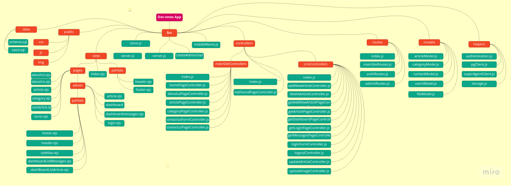
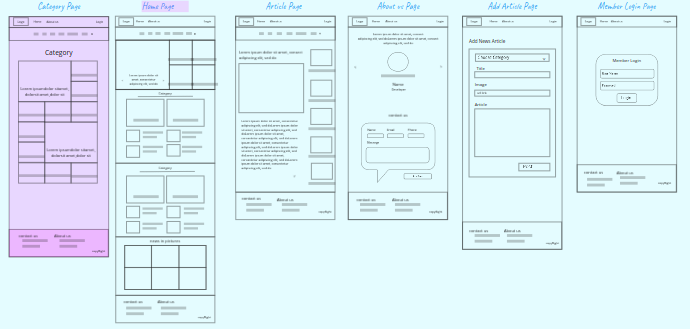
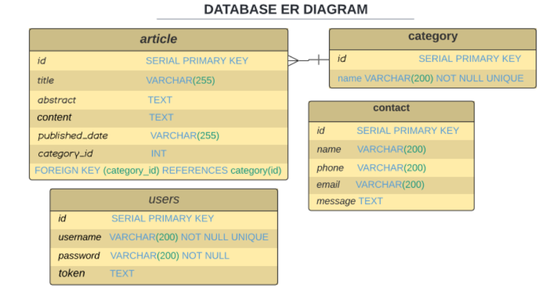
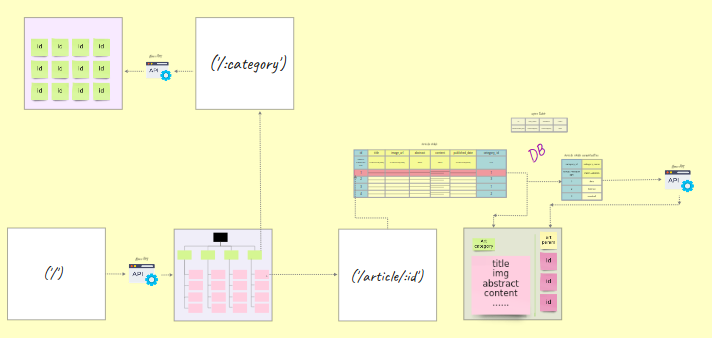

# Project Name: Dot-News

## Team Members

1. Wesam Al-Masri (TL)
2. Wafa'a Ankoush
3. Mohammad Nofal
4. Nour Abu Elenein
5. Tamara Manaseer

## Vision

The journalism community boldly innovates to better engage and inform the public.

We believe that the internet is the most powerful communications medium to arise since the dawn of television. As digital delivery systems become the primary source of news for a growing segment of the world’s population, it presents complex challenges and opportunities for journalists as well as the news audience.

## UML

## Wireframes

## Domain Modeling

